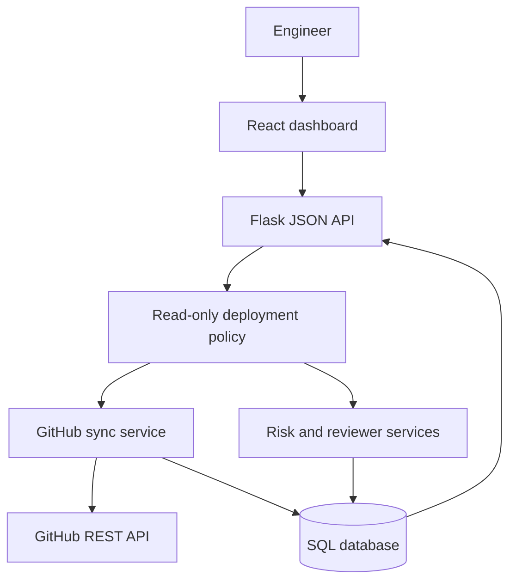

# PR Review Intelligence

[](https://github.com/connorg45/pr-review-intelligence/actions/workflows/ci.yml)
[](LICENSE)
[](https://render.com/deploy?repo=https://github.com/connorg45/pr-review-intelligence)

A pull request operations dashboard that surfaces risky changes, explains each risk score, recommends likely reviewers, and records repository activity.

PR Review Intelligence imports recent pull requests and changed files from the GitHub REST API, calculates risk from explicit change signals, and presents the evidence behind every result. It helps engineers prioritize review work without hiding decisions behind an opaque score.

## Features

- Syncs recent pull requests, changed files, and review history from GitHub
- Scores code churn, sensitive paths, migrations, workflow changes, missing tests, and PR age
- Explains every risk score with human-readable factors
- Recommends reviewers from repository history and file-area overlap
- Preserves file and analysis records when repeated syncs find no changes
- Records successful and failed synchronization activity
- Includes a seven-pull-request sample dataset for evaluation without credentials
- Runs as one React, Flask, and PostgreSQL or SQLite service

## Safety model

Hosted deployments are read-only by default. The dashboard, queue, pull request details, risk explanations, reviewer suggestions, and activity history remain available, while HTTP write operations return `403`.

Repository sync, sample reset, and risk re-analysis can be enabled only for a trusted local or private deployment by setting `WRITE_OPERATIONS_ENABLED=true`. Keep `GITHUB_TOKEN` unset on a public deployment. The application does not provide multi-user authentication or tenant isolation.

## Architecture



Flask serves the compiled React application and `/api` from the same origin. The GitHub client owns authentication, pagination, timeouts, and API error mapping. Service modules own synchronization, risk analysis, reviewer selection, activity events, and dashboard aggregation. SQLAlchemy models own persistence and serialization.

See [Architecture](docs/ARCHITECTURE.md) for request flow, boundaries, and technical decisions.

## Technology

| Area | Stack |
| --- | --- |
| Frontend | React 18, TypeScript, Vite, Tailwind CSS, TanStack Query, Axios |
| Backend | Python 3.12, Flask, SQLAlchemy, Flask-Migrate |
| Data | PostgreSQL in hosted deployments, SQLite for local use |
| Testing | pytest, Vitest, TypeScript compiler, dependency audits |
| Delivery | Docker, Gunicorn, GitHub Actions, Render Blueprint |

## Quickstart with Docker Compose

Prerequisites: Docker with Compose and Git.

```bash
git clone https://github.com/connorg45/pr-review-intelligence.git
cd pr-review-intelligence
docker compose up --build
```

Open `http://localhost:8000`. Compose enables write operations for local use, creates the database, and loads the sample dataset.

To sync a repository, use a fine-grained token with read-only access to repository metadata, pull requests, and contents:

```bash
export GITHUB_TOKEN=github_pat_your_token
docker compose up --build
```

Do not use a token that grants more repository access than the deployment requires.

## Local development

Prerequisites: Python 3.12 and Node.js 20.19 or newer.

### Backend

```bash
cd backend
python3.12 -m venv .venv
source .venv/bin/activate
pip install -r requirements.lock
cp .env.example .env
python run.py
```

The API starts at `http://localhost:5000`. The example environment enables write operations for local development only.

### Frontend

```bash
cd frontend
npm ci
npm run dev
```

The frontend starts at `http://localhost:5173` and proxies `/api` to Flask.

## API

| Method | Endpoint | Purpose | Public hosted default |
| --- | --- | --- | --- |
| `GET` | `/api/health` | Verify service and database health | Available |
| `GET` | `/api/dashboard/summary` | Load summary metrics and recent activity | Available |
| `GET` | `/api/pull-requests` | Search, filter, and sort pull requests | Available |
| `GET` | `/api/pull-requests/<id>` | Load files, analysis, recommendations, and activity | Available |
| `POST` | `/api/pull-requests/<id>/analyze` | Store a fresh risk score | Disabled |
| `POST` | `/api/repositories/sync` | Sync a GitHub repository or sample data | Disabled |
| `POST` | `/api/demo/reset` | Rebuild sample repositories | Disabled |
| `GET` | `/api/events` | Load recent activity | Available |
| `GET` | `/api/config` | Inspect non-secret runtime configuration | Available |

## Verification

```bash
cd backend
pytest -q
python -m scripts.benchmark --iterations 250

cd ../frontend
npm ci
npm audit --audit-level=high
npm test
npm run build

cd ..
docker build -t pr-review-intelligence:test .
```

GitHub Actions runs backend tests and dependency audit, frontend tests and dependency audit, the TypeScript production build, a Docker image build, and a container health smoke test.

## Measured performance

The recorded local measurements use Python 3.12, an in-memory SQLite database, the seven-pull-request sample dataset, and 250 requests per endpoint.

| Endpoint | Median | p95 |
| --- | ---: | ---: |
| `/api/health` | 0.24 ms | 0.29 ms |
| `/api/dashboard/summary` | 4.84 ms | 6.43 ms |
| `/api/pull-requests` | 3.72 ms | 3.89 ms |
| `/api/events?limit=100` | 3.88 ms | 4.36 ms |

These are application-level local measurements without network latency. See [Performance](docs/PERFORMANCE.md) for the method and full result set.

## Deployment

The included Render Blueprint provisions a Docker web service and PostgreSQL database. It explicitly keeps write operations disabled. See [Deployment](docs/DEPLOYMENT.md) before enabling any optional integration.

## Project structure

```text
backend/            Flask API, services, models, migrations, scripts, and tests
frontend/           React application and frontend tests
docs/               Architecture, deployment, demo, and performance notes
.github/workflows/  Continuous integration
```

## Current tradeoffs

- Repository sync runs inside the request; a larger system should move it to a queue.
- Reviewer recommendations use PR authorship and file-area overlap rather than review assignments or CODEOWNERS.
- The application is single-user and has no team authentication or tenant isolation.
- Risk weights are fixed and should be calibrated against a team's own review outcomes.
- The public hosting profile is intentionally read-only.

## Project policies

- [Contributing](CONTRIBUTING.md)
- [Security](SECURITY.md)
- [MIT License](LICENSE)
