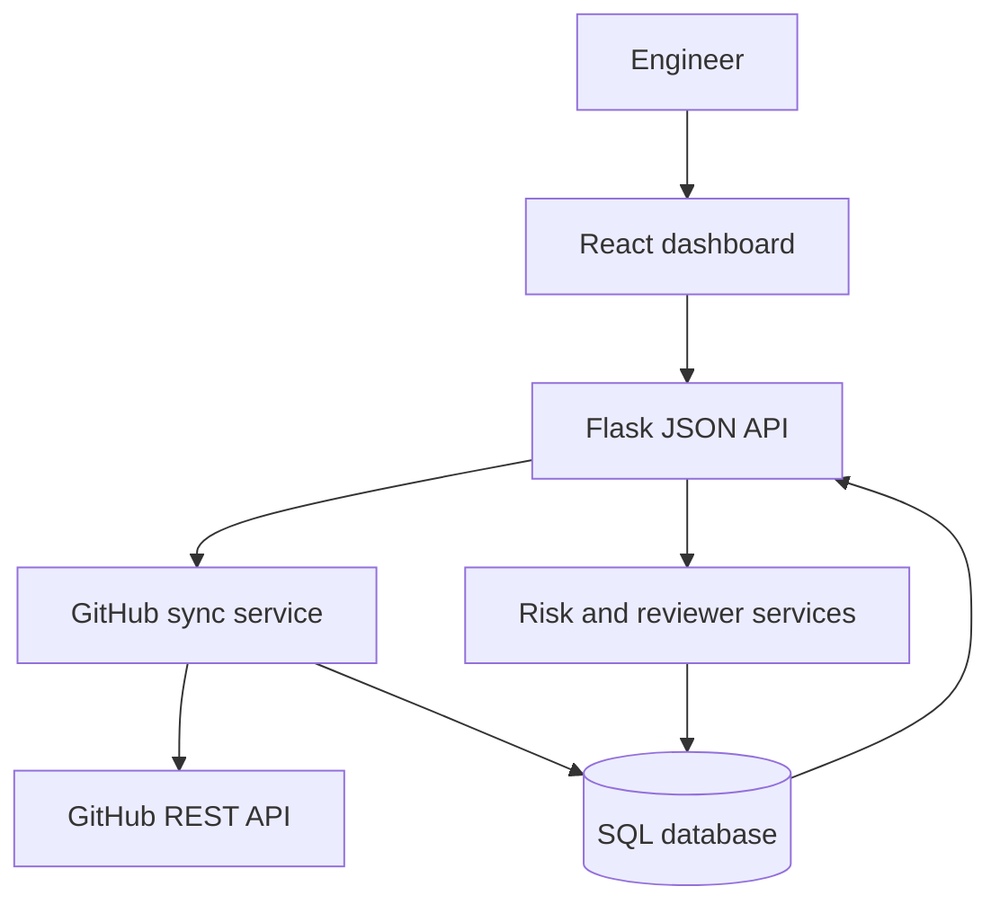

# Architecture

PR Review Intelligence is deployed as one web service. Flask serves the compiled React application and the JSON API from the same origin. This keeps deployment simple and avoids production CORS or API URL mismatches.

## Request flow

1. The deployment policy rejects state-changing API requests unless writes were explicitly enabled for a trusted instance.
2. An engineer starts a repository sync from Settings on a trusted instance.
3. The API validates the repository target and sync limit before making external requests.
4. The GitHub client fetches repository metadata, pull requests, changed files, and reviews with pagination and request timeouts.
5. The sync service upserts pull requests by repository and PR number. Repeated syncs do not duplicate records or analysis history when the source data is unchanged.
6. Changed pull requests are scored from explicit change signals and matched with reviewer candidates from repository history.
7. The API stores the sync result, analysis reasons, reviewer evidence, and activity events in one transaction.
8. React Query refreshes the dashboard, queue, detail view, and activity feed.

## Boundaries

| Layer | Responsibility | Does not own |
| --- | --- | --- |
| Routes | HTTP validation, status codes, response shapes | GitHub calls or scoring rules |
| Deployment policy | Rejects HTTP writes in read-only deployments | User authentication |
| Services | Sync orchestration, scoring, recommendations, aggregation | Rendering UI |
| Models | Persistence, relationships, serialization | Request validation |
| GitHub client | Authentication, pagination, timeouts, API errors | Database writes |
| React pages | User workflows and query state | Risk calculations |

## Technical decisions

### Risk scoring

Risk results are based on visible signals such as code churn, sensitive paths, migrations, workflow changes, test coverage, and PR age. Every score includes human-readable reasons. This makes the result testable and useful in a review conversation.

### Idempotent synchronization

The system compares GitHub metadata and a normalized changed-file snapshot before writing a new analysis. An unchanged sync updates its last-seen timestamp but preserves file rows and analysis history.

### Same-origin deployment

The Docker image builds the React application first and copies the static output into the Python runtime. Gunicorn serves both the SPA and `/api` routes. Local Vite development uses a proxy to keep the same `/api` client configuration.

### Read-only public hosting

HTTP writes are disabled unless `WRITE_OPERATIONS_ENABLED=true`. The Render Blueprint keeps this setting false. Trusted local and private deployments can enable it explicitly; the application does not claim to provide multi-user authorization.

### Database portability

SQLite supports fast local setup and Docker Compose persistence. PostgreSQL is supported through `DATABASE_URL` for hosted deployments. SQLite timestamps are normalized to UTC at service boundaries to avoid naive and aware datetime errors.

## Failure handling

- GitHub requests have explicit timeouts and actionable error messages.
- Failed syncs are stored as failed runs with an audit event.
- Demo reset deletes only sample repositories and preserves GitHub-synced data.
- API 404 and 500 responses are JSON, while valid client-side routes fall back to the React entry point.
- The health endpoint checks database connectivity and returns HTTP 503 when storage is unavailable.
